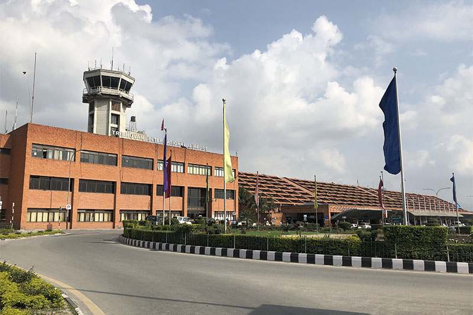
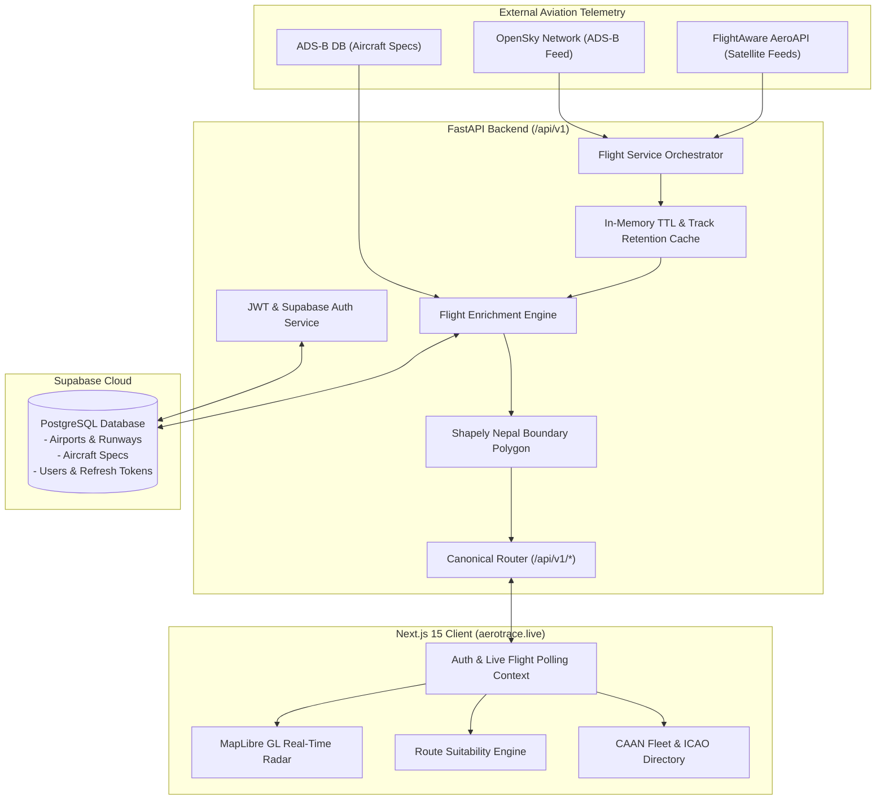

<div align="center">

  

  # ✈️ AeroTrace: Nepal Airspace Monitor & Flight Tracker

  **A high-precision, provider-independent real-time aviation intelligence platform engineered for the Kathmandu Flight Information Region (VNKT FIR) and Himalayan flight corridors.**

  [](https://aerotrace.live)
  [](https://fastapi.tiangolo.com)
  [-black?style=for-the-badge&logo=next.js&logoColor=white)](https://nextjs.org)
  [](https://www.typescriptlang.org)
  [](https://tailwindcss.com)
  [](https://supabase.com)
  [](https://maplibre.org)
  [](LICENSE)

  <p align="center">
    <a href="#-key-features">Key Features</a> •
    <a href="#-live-demonstration--screenshots">Screenshots</a> •
    <a href="#-system-architecture">Architecture</a> •
    <a href="#-api-reference">API Reference</a> •
    <a href="#-getting-started">Getting Started</a> •
    <a href="#-deployment">Deployment</a> •
    <a href="#-license--author">Credits</a>
  </p>

</div>

---

## 📸 Screenshots & Visual Overview

<div align="center">

### 🛰️ Live Radar & Airspace Surveillance Dashboard
<!-- PLACEHOLDER: Insert high-resolution screenshot of the main radar dashboard with active aircraft and telemetry cards -->

<p><em>Real-time vector radar visualizing commercial and regional aircraft transiting the Himalayan corridor with directional markers, heading vectors, and spatial breadcrumbs.</em></p>

<br />

| 🛫 Flight Telemetry Dossier | ⚖️ Route Aircraft Analyzer |
| :---: | :---: |
| <!-- PLACEHOLDER: Insert screenshot of the detailed aircraft drawer / specs card -->  | <!-- PLACEHOLDER: Insert screenshot of Route Analyzer comparison table & map -->  |
| *Real-time telemetry, altitude graphs, groundspeed, and CAAN aircraft specification integration.* | *Mathematical suitability analysis evaluating TOFL, LFL, headwinds, and route viability.* |

<br />

| 🇳🇵 Nepal Civil Fleet Catalog | 🏔️ Runway & Airport Encyclopedia |
| :---: | :---: |
| <!-- PLACEHOLDER: Insert screenshot of the Nepal registered fleet table/search -->  | <!-- PLACEHOLDER: Insert screenshot of airport runways and physical coordinates -->  |
| *Comprehensive 9N- registered fleet catalog indexed with operators, models, and serials.* | *Runway threshold headings, lengths, surface types, and elevations for all Nepal aerodromes.* |

</div>

---

## 🌟 Key Features

### 1. 📡 Real-Time Airspace Radar & Trajectory Trails
* **Vector Radar Engine**: Powered by MapLibre GL with dark, liberty, bright, and positron tile styling options.
* **Spatial Breadcrumbs & Trail Retention**: In-memory historical coordinate store rendering accurate aircraft flight trails (up to 120 breadcrumb nodes) without flickering over mountainous terrain.
* **Terrain Shadowing Compensation**: Built-in 75-second dead-reckoning retention model preventing aircraft drops during transponder fade in high-elevation valleys.

### 2. 🔀 Dual Telemetry Engine (OpenSky & FlightAware AeroAPI)
* **OpenSky Network Adapter**: Normalizes crowd-sourced ADS-B state vectors with OAuth2 authentication and intelligent rate-limiting.
* **FlightAware AeroAPI Integration**: On-demand high-fidelity "Detailed Flights Mode" leveraging space-based satellite ADS-B and filed IFR airline flight plans for 100% coverage across the Himalayas.
* **Automated Fallback & In-Memory TTL Cache**: Server-side cache layer preventing external provider rate exhaustion while serving sub-millisecond responses to client sessions.

### 3. 🇳🇵 Strict Nepal Airspace Boundary Filtering
* **Kathmandu FIR Geographic Corridors**: Evaluates Nepal's international border geometry via Shapely prepared polygon algorithms.
* **Context Filtering**: Transparently segments traffic into:
  * Inbound flights arriving at Nepalese airports (e.g., VNKT, VNPK, VNBW).
  * Outbound international departures.
  * Domestic operations (Buddha Air, Yeti Airlines, Shree Airlines, Nepal Airlines, Tara Air, Summit Air).
  * High-altitude transit overflights physically crossing Nepal airspace, while excluding unrelated foreign traffic.

### 4. 📐 Route Aircraft Suitability Analyzer
* **Aeronautical Engineering Comparison**: Evaluates aircraft technical specifications against city pairs within Nepal (e.g., Kathmandu `VNKT` → Pokhara `VNPK` or Lukla `VNLK`).
* **Physics & Environmental Inputs**: Computes great-circle Haversine distances, destination longest runway availability, wind effect (headwind/tailwind velocity vectors), and cruise groundspeeds.
* **Operational Margins**: Calculates Takeoff Field Length (TOFL) margins, Landing Field Length (LFL) margins, and nominal fuel range envelopes.

### 5. 📚 Nepal Civil Aviation & Airport Encyclopedia
* **CAAN 9N- Fleet Registry**: Complete database linking 9N- registrations with ICAO type codes, manufacturers, maximum takeoff weights (MTOW), engine configurations, and airline operators.
* **Comprehensive Aerodromes Catalog**: Complete directory of all commercial airports, regional airstrips, and STOL airfields with elevation, IATA/ICAO codes, runway surfaces, and magnetic headings.
* **Official ICAO Phonetic Alphabet**: Quick-reference phonetic alphabet, pronunciation guide, and international Morse code transmitter.

### 6. 🔐 Enterprise Authentication & Session Security
* **Supabase Google OAuth SSO**: Seamless single-click Google authentication with automated server-side verification.
* **JWT Access & Refresh Token Rotation**: PBKDF2-HMAC-SHA256 password hashing with server-side token revocation and automatic refresh hydration.
* **Canonical API Standard**: 100% of application communication operates under the standardized `/api/v1` namespace.

---

## 🏗️ System Architecture

AeroTrace is organized as a modern decoupled monorepo, separating server-side aviation calculations and data enrichment from a high-performance interactive client.



---

## 📡 API Reference

All backend application APIs are canonically exposed under the `/api/v1` namespace.

### Core Application Endpoints

| Method | Endpoint | Description | Access |
| :--- | :--- | :--- | :--- |
| `GET` | `/api/v1/health` | System liveness probe and API version | Public |
| `GET` | `/api/v1/health/db` | Supabase PostgreSQL database connection probe | Public |
| `POST` | `/api/v1/auth/google/verify` | Verify Supabase Google OAuth session & issue JWTs | Public |
| `POST` | `/api/v1/auth/register` | Register new user account with first/last name & password | Public |
| `POST` | `/api/v1/auth/login` | Authenticate credentials & return access/refresh tokens | Public |
| `POST` | `/api/v1/auth/guest` | Generate temporary guest session token | Public |
| `GET` | `/api/v1/auth/me` | Fetch active user profile from Bearer JWT | Protected |
| `POST` | `/api/v1/auth/refresh` | Exchange active refresh token for fresh access token | Public |
| `POST` | `/api/v1/auth/logout` | Revoke active refresh token session on the server | Protected |
| `GET` | `/api/v1/flights/live` | Retrieve live normalized flights within Nepal corridor | Protected |
| `GET` | `/api/v1/flights/cache/stats`| Diagnostic cache hit ratio and track persistence stats | Protected |
| `GET` | `/api/v1/flights/{icao24}` | Fetch telemetry details for specific aircraft by hex | Protected |
| `GET` | `/api/v1/flights/{icao24}/trajectory` | Retrieve historical coordinate breadcrumbs (trail) | Protected |
| `GET` | `/api/v1/airports` | Paginated airport search by query, country, or code | Public |
| `GET` | `/api/v1/airports/nepal` | Retrieve all airports and STOL airstrips in Nepal | Public |
| `GET` | `/api/v1/airports/{ident}` | Detailed airport data including elevations and surface | Public |
| `GET` | `/api/v1/airports/{ident}/runways` | Retrieve physical runways and threshold headings | Public |
| `GET` | `/api/v1/aircraft` | Search commercial aircraft engineering specifications | Protected |
| `GET` | `/api/v1/aircraft/{identifier}` | Aircraft specification by model or ICAO type code | Protected |
| `GET` | `/api/v1/aircraft/nepal/fleet` | List Nepal civil fleet with linked CAAN specifications | Protected |
| `GET` | `/api/v1/aircraft/nepal/{id}` | Retrieve specific Nepal aircraft by tail registration | Protected |
| `POST`| `/api/v1/route-analyzer/analyze` | Perform engineering suitability evaluation for route | Protected |
| `GET` | `/api/v1/route-analyzer/route` | Compute distance & longest runway between aerodromes | Protected |
| `GET` | `/api/v1/icao/phonetic` | Retrieve official 26-letter ICAO Phonetic Alphabet | Public |

---

## 🛠️ Technology Stack

| Domain | Technology | Purpose |
| :--- | :--- | :--- |
| **Frontend Framework** | [Next.js 15](https://nextjs.org/) (App Router) | React Server Components, server actions, route handlers |
| **UI Library** | [React 19](https://react.dev/), [Tailwind CSS v4](https://tailwindcss.com/) | Responsive interface, fluid radar animations, modern theme |
| **Component System**| [HeroUI](https://heroui.com/), [Lucide React](https://lucide.dev/) | Aviation icons, modal dialogs, drawers, and tabs |
| **Interactive Mapping**| [MapLibre GL JS](https://maplibre.org/) | High-performance WebGL 2D/3D vector map rendering |
| **Backend Framework** | [FastAPI](https://fastapi.tiangolo.com/) (Python 3.11+) | Asynchronous, auto-documented RESTful API service |
| **Server Engine** | [Uvicorn](https://www.uvicorn.org/) | Lightning-fast ASGI web server implementation |
| **Database** | [Supabase](https://supabase.com/) (PostgreSQL 15) | Relational aviation storage, spatial indexes, Google OAuth |
| **Data Validation** | [Pydantic v2](https://docs.pydantic.dev/) | Strict schema validation, settings management, data normalization |
| **Geospatial Processing**| [Shapely](https://shapely.readthedocs.io/) | Prepared geometries for microsecond polygon point containment |
| **HTTP Clients** | [HTTPX](https://www.python-httpx.org/) | Asynchronous non-blocking HTTP requests to external APIs |

---

## 🚀 Getting Started

### Prerequisites
* **Node.js**: `v20.x` or higher
* **Python**: `3.11.x` or higher
* **Package Managers**: `npm` / `pnpm` and `pip`
* **Supabase Project**: Free-tier PostgreSQL instance with Auth configured

---

### 1. Repository Setup

```bash
# Clone the repository
git clone https://github.com/Mandipgit/nepal-airspace-monitor.git
cd nepal-airspace-monitor
```

---

### 2. Backend Setup

```bash
# Navigate to backend directory
cd backend

# Create and activate Python virtual environment
python -m venv venv
# On Windows:
venv\Scripts\activate
# On Linux/macOS:
source venv/bin/activate

# Install dependencies
pip install -r requirements.txt

# Configure environment variables
cp .env.example .env
```

Edit `backend/.env` with your credentials:
```ini
HOST=0.0.0.0
PORT=8000
ENVIRONMENT=development
ALLOWED_ORIGINS=http://localhost:3000,http://127.0.0.1:3000,https://aerotrace.live

# Supabase Configuration
SUPABASE_URL=https://your-project.supabase.co
SUPABASE_KEY=your-anon-key
SUPABASE_SERVICE_ROLE_KEY=your-service-role-key

# JWT Secret
JWT_SECRET=your-secure-random-secret-key-at-least-32-chars

# External Aviation Providers (Optional for development)
OPENSKY_USERNAME=
OPENSKY_PASSWORD=
FLIGHTAWARE_API_KEY=
```

Start the FastAPI backend:
```bash
uvicorn app.main:app --reload --host 0.0.0.0 --port 8000
```
*API documentation will be available at:* `http://localhost:8000/docs`

---

### 3. Frontend Setup

In a new terminal window:

```bash
# Navigate to frontend directory
cd frontend

# Install Node dependencies
npm install

# Configure environment variables
cp .env.example .env.local
```

Edit `frontend/.env.local`:
```ini
NEXT_PUBLIC_API_BASE_URL=http://localhost:8000/api/v1
NEXT_PUBLIC_FLIGHT_POLL_INTERVAL_MS=2000

# Map Settings
NEXT_PUBLIC_MAP_DEFAULT_LAT=28.3949
NEXT_PUBLIC_MAP_DEFAULT_LON=84.1240
NEXT_PUBLIC_MAP_DEFAULT_ZOOM=7

# Supabase Auth
NEXT_PUBLIC_SUPABASE_URL=https://your-project.supabase.co
NEXT_PUBLIC_SUPABASE_ANON_KEY=your-anon-key
```

Run the development server:
```bash
npm run dev
```

Open [http://localhost:3000](http://localhost:3000) in your browser.

---

### 4. Running Automated Tests

```bash
cd backend
python -m unittest discover -s tests
```

---

## 🌐 Production Deployment

The platform is optimized for seamless deployment across standard cloud providers:

| Layer | Recommended Host | Configuration Highlights |
| :--- | :--- | :--- |
| **Frontend** | [Vercel](https://vercel.com/) | Set `NEXT_PUBLIC_API_BASE_URL=https://aerotrace-backend.onrender.com/api/v1`. Supports custom domains (`aerotrace.live`). |
| **Backend** | [Render](https://render.com/) | Python Web Service running `uvicorn app.main:app --host 0.0.0.0 --port $PORT`. Health check path `/health`. |
| **Database** | [Supabase](https://supabase.com/) | Enable Google Provider under Authentication. Add `https://aerotrace.live/auth/callback` to Redirect URLs. |

---

## 📜 Development Principles

1. **Anti-Vibe-Coding**: Every layer is engineered with empirical testing, typed contracts, and deterministic calculations.
2. **Rate & Cost Consciousness**: External providers are cached on the server and debounced to prevent quota exhaustion.
3. **Zero Fabricated Live Data**: Missing coordinates or unresolved routes remain transparently null; no synthetic aircraft simulate live radar tracks.

---

## 👨‍💻 Author & Credits

* **Architect & Developer**: **Mandeep Pokharel** ([@Mandipgit](https://github.com/Mandipgit))
* **Live Deployment**: [aerotrace.live](https://aerotrace.live)
* **Data Sources**: [OpenSky Network](https://opensky-network.org/), [FlightAware AeroAPI](https://www.flightaware.com/commercial/aeroapi/), [Civil Aviation Authority of Nepal (CAAN)](https://caanepal.gov.np/), [OpenFreeMap](https://openfreemap.org/).

---

## 📄 License

This project is licensed under the MIT License - see the [LICENSE](LICENSE) file for details.
